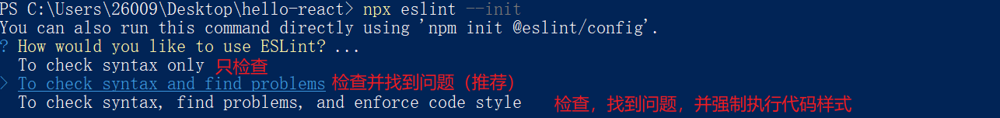
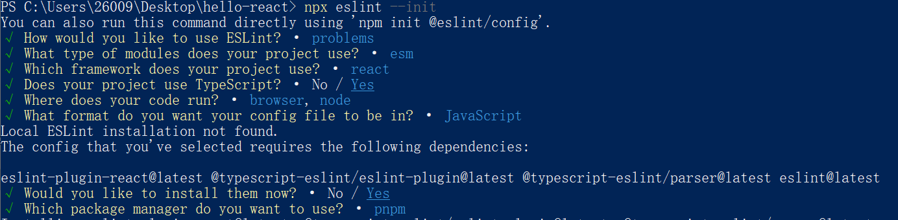

# vite+react18+ts 项目搭建

## 1.全局安装 pnpm

```bash
npm install pnpm -g
```

## 2.全局安装 vite

```bash
npm install -g vite
```

## 3.全局安装 eslint

```bash
npm install -g eslint
```

## 4.插件准备

插件：Stylelint、ESLint、Prettier - Code formatter

工作区插件配置：

```json
{
  "editor.formatOnSave": true,
  "editor.defaultFormatter": "esbenp.prettier-vscode",
  "editor.codeActionsOnSave": {
    "source.fixAll.eslint": true,
    "source.fixAll.stylelint": true
  },
  "stylelint.validate": ["css", "less", "scss"]
}
```

## 5.使用 eslint 初始化当前项目使用 eslint

### 1.package.json 加入脚本

```json
"scripts": {
  "lint:create": "eslint --init",
},
```

### 2.执行 pnpm run lint:create

### 3.选择配置项





## 6.配置使用 eslint、prettier 对代码进行格式化

### 1.安装 eslint、prettier、相关校验规则依赖

```bash
pnpm install eslint-config-prettier eslint-plugin-prettier prettier eslint-plugin-react-hooks -D
```

### 2.初始化 eslint 项目后，项目根目录会生成.eslintrc.cjs 文件，重写该文件

```javascript
module.exports = {
  settings: {
    react: {
      version: "detect",
    },
  },
  root: true,
  env: {
    browser: true,
    node: true,
    es6: true,
  },
  /* 指定如何解析语法 */
  parser: "@typescript-eslint/parser",
  /* 优先级低于 parse 的语法解析配置 */
  parserOptions: {
    ecmaVersion: 2020,
    sourceType: "module",
    jsxPragma: "React",
    ecmaFeatures: {
      jsx: true,
    },
  },
  plugins: ["react", "@typescript-eslint", "react-hooks", "prettier"],
  /* 继承某些已有的规则 */
  extends: [
    "eslint:recommended",
    "plugin:react/recommended",
    "plugin:@typescript-eslint/recommended",
    "plugin:react/jsx-runtime",
    "plugin:react-hooks/recommended",
    "prettier",
    "plugin:prettier/recommended",
  ],
  /*
   * "off" 或 0    ==>  关闭规则
   * "warn" 或 1   ==>  打开的规则作为警告（不影响代码执行）
   * "error" 或 2  ==>  规则作为一个错误（代码不能执行，界面报错）
   */
  rules: {
    // eslint (http://eslint.cn/docs/rules)
    "no-var": "error", // 要求使用 let 或 const 而不是 var
    "no-multiple-empty-lines": ["error", { max: 1 }], // 不允许多个空行
    "no-use-before-define": "off", // 禁止在 函数/类/变量 定义之前使用它们
    "prefer-const": "off", // 此规则旨在标记使用 let 关键字声明但在初始分配后从未重新分配的变量，要求使用 const
    "no-irregular-whitespace": "off", // 禁止不规则的空白
    // typeScript (https://typescript-eslint.io/rules)
    "@typescript-eslint/no-unused-vars": "error", // 禁止定义未使用的变量
    "@typescript-eslint/no-inferrable-types": "off", // 可以轻松推断的显式类型可能会增加不必要的冗长
    "@typescript-eslint/no-namespace": "off", // 禁止使用自定义 TypeScript 模块和命名空间。
    "@typescript-eslint/no-explicit-any": "off", // 禁止使用 any 类型
    "@typescript-eslint/ban-ts-ignore": "off", // 禁止使用 @ts-ignore
    "@typescript-eslint/ban-types": "off", // 禁止使用特定类型
    "@typescript-eslint/explicit-function-return-type": "off", // 不允许对初始化为数字、字符串或布尔值的变量或参数进行显式类型声明
    "@typescript-eslint/no-var-requires": "off", // 不允许在 import 语句中使用 require 语句
    "@typescript-eslint/no-empty-function": "off", // 禁止空函数
    "@typescript-eslint/no-use-before-define": "off", // 禁止在变量定义之前使用它们
    "@typescript-eslint/ban-ts-comment": "off", // 禁止 @ts-<directive> 使用注释或要求在指令后进行描述
    "@typescript-eslint/no-non-null-assertion": "off", // 不允许使用后缀运算符的非空断言(!)
    "@typescript-eslint/explicit-module-boundary-types": "off", // 要求导出函数和类的公共类方法的显式返回和参数类型
    // react (https://github.com/jsx-eslint/eslint-plugin-react)
    "react-hooks/rules-of-hooks": "off",
    "react-hooks/exhaustive-deps": "off",
  },
};
```

### 3.项目根目录下新增.eslintrcignore 文件，取消对不必要文件的语法校验和格式化

```
*.sh
node_modules
*.md
*.woff
*.ttf
.vscode
.idea
dist
/public
/docs
.husky
.local
/bin
.eslintrc.cjs
.prettierrc.cjs
```

## 7.解决 eslint 与 prettier 的校验规则冲突

1.项目根目录下新增.prettierrc.cjs 文件，并写入内容：

```javascript
module.exports = {
  // 超过最大值换行
  printWidth: 130,
  // 缩进字节数
  tabWidth: 2,
  // 使用制表符而不是空格缩进行
  useTabs: true,
  // 结尾不用分号(true有，false没有)
  semi: true,
  // 使用单引号(true单双引号，false双引号)
  singleQuote: false,
  // 更改引用对象属性的时间 可选值"<as-needed|consistent|preserve>"
  quoteProps: "as-needed",
  // 在对象，数组括号与文字之间加空格 "{ foo: bar }"
  bracketSpacing: true,
  // 多行时尽可能打印尾随逗号。（例如，单行数组永远不会出现逗号结尾。） 可选值"<none|es5|all>"，默认none
  trailingComma: "none",
  // 在JSX中使用单引号而不是双引号
  jsxSingleQuote: false,
  //  (x) => {} 箭头函数参数只有一个时是否要有小括号。avoid：省略括号 ,always：不省略括号
  arrowParens: "avoid",
  // 如果文件顶部已经有一个 doclock，这个选项将新建一行注释，并打上@format标记。
  insertPragma: false,
  // 指定要使用的解析器，不需要写文件开头的 @prettier
  requirePragma: false,
  // 默认值。因为使用了一些折行敏感型的渲染器（如GitHub comment）而按照markdown文本样式进行折行
  proseWrap: "preserve",
  // 在html中空格是否是敏感的 "css" - 遵守CSS显示属性的默认值， "strict" - 空格被认为是敏感的 ，"ignore" - 空格被认为是不敏感的
  htmlWhitespaceSensitivity: "css",
  // 换行符使用 lf 结尾是 可选值"<auto|lf|crlf|cr>"
  endOfLine: "auto",
  // 这两个选项可用于格式化以给定字符偏移量（分别包括和不包括）开始和结束的代码
  rangeStart: 0,
  rangeEnd: Infinity,
  // Vue文件脚本和样式标签缩进
  vueIndentScriptAndStyle: false,
};
```

2.项目根目录下新增.prettierignore 文件，取消对不必要文件的格式化

```
/dist/*
.local
/node_modules/**
**/*.svg
**/*.sh
/public/*
```

## 8.对 tsconfig.json 文件的配置进行修改

```json
{
  "compilerOptions": {
    "target": "ESNext",
    "useDefineForClassFields": true,
    "lib": ["DOM", "DOM.Iterable", "ESNext"],
    "allowJs": false,
    "skipLibCheck": true,
    "esModuleInterop": false,
    "allowSyntheticDefaultImports": true,
    /* Strict Type-Checking Options */
    "strict": true /* Enable all strict type-checking options. */,
    // "noImplicitAny": true,                 /* Raise error on expressions and declarations with an implied 'any' type. */
    // "strictNullChecks": true,              /* Enable strict null checks. */
    // "strictFunctionTypes": true,           /* Enable strict checking of function types. */
    // "strictBindCallApply": true,           /* Enable strict 'bind', 'call', and 'apply' methods on functions. */
    // "strictPropertyInitialization": true,  /* Enable strict checking of property initialization in classes. */
    // "noImplicitThis": true,                /* Raise error on 'this' expressions with an implied 'any' type. */
    // "alwaysStrict": true,                  /* Parse in strict mode and emit "use strict" for each source file. */
    "forceConsistentCasingInFileNames": true,
    "module": "ESNext",
    "moduleResolution": "Node",
    "resolveJsonModule": true,
    "isolatedModules": true,
    "noEmit": true,
    "jsx": "react-jsx",
    // 解析非相对模块名的基准目录
    "baseUrl": "./",
    // 模块名到基于 baseUrl的路径映射的列表。
    "paths": {
      "@": ["src"],
      "@/*": ["src/*"]
    }
  },
  "include": ["src/**/*.ts", "src/**/*.d.ts", "src/**/*.tsx", "vite.config.ts"],
  "exclude": ["node_modules", "dist", "**/*.js"]
}
```

## 9.配置 package.json，eslint 校验并修复代码脚本

```json
"scripts": {
  "lint": "eslint \"src/**/*.{js,tsx,ts}\" --fix"
},
此时可以运行pnpm run lint来校验并修复存在代码格式或语法错误的文件
```

## 10.配置 package.json，prettier 格式化代码脚本

```json
"scripts": {
  "prettier-format": "prettier --config .prettierrc.cjs \"src/**/*.{js,ts,json,tsx,css,less,scss,html,md}\" --write",
},
此时可以运行pnpm run prettier-format来格式化代码
```

## 11.使用 lint-staged 只对暂存区的文件进行格式化

### 1.安装 lint-staged

```bash
pnpm install husky lint-staged -D
```

### 2.安装 husky

1.安装

```bash
pnpm install husky --save-dev
```

2.激活钩子

```bash
npx husky install
```

2.设置安装依赖时自动激活钩子脚本

```bash
pnpm set-script prepare "husky install"
```

### 3.package.json 添加 lint-staged 节点，用 lint-staged 对暂存区文件进行格式化

```json
"lint-staged": {
  "*.{js,jsx,ts,tsx}": [
    "npm run lint",
    "npm run prettier-format"
  ]
}
```

### 4.添加 husky 钩子，提交时触发 npx lint-stage 命令

```bash
npx husky add .husky/pre-commit "npx lint-staged"
```

## 12.配置使用 lint-staged 触发 stylelint 格式化 css

### 1.安装相关依赖

```bash
pnpm install stylelint stylelint-config-prettier stylelint-config-recess-order stylelint-config-standard stylelint-less -D
```

### 2.项目根目录下创建.stylelintrc.cjs 文件，并使用相关规则

```javascript
module.exports = {
  extends: [
    "stylelint-config-standard", // 配置stylelint拓展插件
    "stylelint-config-prettier", // 配置stylelint和prettier兼容
    "stylelint-config-recess-order", // 配置stylelint css属性书写顺序插件
  ],
  plugins: ["stylelint-less"], // 配置stylelint less拓展插件
  rules: {
    indentation: null, // 指定缩进空格
    "no-descending-specificity": null, // 禁止在具有较高优先级的选择器后出现被其覆盖的较低优先级的选择器
    "function-url-quotes": "always", // 要求或禁止 URL 的引号 "always(必须加上引号)"|"never(没有引号)"
    "string-quotes": "double", // 指定字符串使用单引号或双引号
    "unit-case": null, // 指定单位的大小写 "lower(全小写)"|"upper(全大写)"
    "color-hex-case": "lower", // 指定 16 进制颜色的大小写 "lower(全小写)"|"upper(全大写)"
    "color-hex-length": "long", // 指定 16 进制颜色的简写或扩写 "short(16进制简写)"|"long(16进制扩写)"
    "rule-empty-line-before": "never", // 要求或禁止在规则之前的空行 "always(规则之前必须始终有一个空行)"|"never(规则前绝不能有空行)"|"always-multi-line(多行规则之前必须始终有一个空行)"|"never-multi-line(多行规则之前绝不能有空行。)"
    "font-family-no-missing-generic-family-keyword": null, // 禁止在字体族名称列表中缺少通用字体族关键字
    "block-opening-brace-space-before": "always", // 要求在块的开大括号之前必须有一个空格或不能有空白符 "always(大括号前必须始终有一个空格)"|"never(左大括号之前绝不能有空格)"|"always-single-line(在单行块中的左大括号之前必须始终有一个空格)"|"never-single-line(在单行块中的左大括号之前绝不能有空格)"|"always-multi-line(在多行块中，左大括号之前必须始终有一个空格)"|"never-multi-line(多行块中的左大括号之前绝不能有空格)"
    "property-no-unknown": null, // 禁止未知的属性(true 为不允许)
    "no-empty-source": null, // 禁止空源码
    "declaration-block-trailing-semicolon": null, // 要求或不允许在声明块中使用尾随分号 string："always(必须始终有一个尾随分号)"|"never(不得有尾随分号)"
    "selector-class-pattern": null, // 强制选择器类名的格式
    "value-no-vendor-prefix": null, // 关闭 vendor-prefix(为了解决多行省略 -webkit-box)
    "at-rule-no-unknown": null,
    "selector-pseudo-class-no-unknown": [
      true,
      {
        ignorePseudoClasses: ["global", "v-deep", "deep"],
      },
    ],
  },
};
```

### 3.项目根目录下创建.stylelintignore 文件，取消对不必要文件的格式化

```
/dist/*
/public/*
```

### 4.配置 package.json，stylelint 格式化 css 脚本

```json
"scripts": {
  "lint:css": "stylelint **/*.{less,css,scss} --fix"
},
```

### 5.package.json 中使用 lint-staged 触发 stylelint 格式化 css 脚本

```json
"lint-staged": {
  "*.{js,jsx,ts,tsx}": [
    "npm run lint",
    "npm run prettier-format"
  ],
  "*.{css,sass,scss}": [
    "npm run lint:css"
  ]
}
```

## 13.规范 git 提交信息

### 1.安装 commitizen 规范 Git 提交说明

Commitizen 是一个撰写符合 Commit Message 标准的一款工具，可以帮助开发者提交符合规范的 Commit Message

```bash
pnpm install commitizen -D
```

### 2.安装 cz-customizable（cz-customizable 是本地适配器）

```bash
pnpm install cz-customizable -D
```

### 3.配置 commitizen，使用 cz-customizable 作为信息交互插件，在 package.json 中添加下面节点

```json
"config": {
  "commitizen": {
    "path": "node_modules/cz-customizable"
  }
}
此时可以执行 git cz 来进行信息交互的方式commit
```

### 4.项目根目录下创建.cz-config.cjs 文件并配置

1.配置 package.json

```json
"config": {
  "commitizen": {
    "path": "node_modules/cz-customizable"
  },
  "cz-customizable": {
    "config": ".cz-config.cjs"
  }
},
```

2.新增.cz-config.cjs 文件

```javascript
module.exports = {
  // type 类型（定义之后，可通过上下键选择）
  types: [
    { value: "feat", name: "feat: 新增功能" },
    { value: "fix", name: "fix: 修复 bug" },
    { value: "docs", name: "docs: 文档变更" },
    {
      value: "style",
      name: "style: 代码格式（不影响功能，例如空格、分号等格式修正）",
    },
    {
      value: "refactor",
      name: "refactor: 代码重构（不包括 bug 修复、功能新增）",
    },
    { value: "perf", name: "perf: 性能优化" },
    { value: "test", name: "test: 添加、修改测试用例" },
    {
      value: "build",
      name: "build: 构建流程、外部依赖变更（如升级 npm 包、修改 webpack 配置等）",
    },
    { value: "ci", name: "ci: 修改 CI 配置、脚本" },
    {
      value: "chore",
      name: "chore: 对构建过程或辅助工具和库的更改（不影响源文件、测试用例）",
    },
    { value: "revert", name: "revert: 回滚 commit" },
  ],
  // scope 类型（定义之后，可通过上下键选择）
  scopes: [
    ["components", "组件相关"],
    ["hooks", "hook 相关"],
    ["utils", "utils 相关"],
    ["element-ui", "对 element-ui 的调整"],
    ["styles", "样式相关"],
    ["deps", "项目依赖"],
    ["auth", "对 auth 修改"],
    ["other", "其他修改"],
    // 如果选择 custom，后面会让你再输入一个自定义的 scope。也可以不设置此项，把后面的 allowCustomScopes 设置为 true
    ["custom", "以上都不是？我要自定义"],
  ].map(([value, description]) => {
    return {
      value,
      name: `${value.padEnd(30)} (${description})`,
    };
  }),
  // 是否允许自定义填写 scope，在 scope 选择的时候，会有 empty 和 custom 可以选择。
  // allowCustomScopes: true,
  // allowTicketNumber: false,
  // isTicketNumberRequired: false,
  // ticketNumberPrefix: 'TICKET-',
  // ticketNumberRegExp: '\\d{1,5}',
  // 针对每一个 type 去定义对应的 scopes，例如 fix
  /*
  scopeOverrides: {
    fix: [
      { name: 'merge' },
      { name: 'style' },
      { name: 'e2eTest' },
      { name: 'unitTest' }
    ]
  },
  */
  // 交互提示信息
  messages: {
    type: "确保本次提交遵循 Angular 规范！\n选择你要提交的类型：",
    scope: "\n选择一个 scope（可选）：",
    // 选择 scope: custom 时会出下面的提示
    customScope: "请输入自定义的 scope：",
    subject: "填写简短精炼的变更描述：\n",
    body: '填写更加详细的变更描述（可选）。使用 "|" 换行：\n',
    breaking: "列举非兼容性重大的变更（可选）：\n",
    footer: "列举出所有变更的 ISSUES CLOSED（可选）。 例如: #31, #34：\n",
    confirmCommit: "确认提交？",
  },
  // 设置只有 type 选择了 feat 或 fix，才询问 breaking message
  allowBreakingChanges: ["feat", "fix"],
  // 跳过要询问的步骤
  // skipQuestions: ['body', 'footer'],
  // subject 限制长度
  subjectLimit: 100,
  breaklineChar: "|", // 支持 body 和 footer
  // footerPrefix : 'ISSUES CLOSED:'
  // askForBreakingChangeFirst : true,
};
此时可以执行 git cz 来进行信息交互的方式commit（交互信息变为中文）
```

### 5.安装 commitlint 检查提交消息是否符合常规提交格式

```bash
pnpm install @commitlint/cli @commitlint/config-conventional -D
```

### 6.项目根目录下创建 commitlint.config.cjs 文件，并标明 commitlint 校验时使用的规范是@commitlint/config-conventional

注意：该处用的提交格式规范是 Conventional Commits，预先配置的 commitizen 信息交互模板要按照前者的规范来配置

```javascript
module.exports = { extends: ["@commitlint/config-conventional"] };
```

### 7.添加 husky 钩子，提交时触发 commitlint 校验

```bash
npx husky add .husky/commit-msg 'npx --no -- commitlint --edit $1'
```

### 8.现在 commit 都会触发 commitlint 中指令来校验提交信息的格式，但是我想每次 commit 都是通过信息交互的方式进行内容填写，可以在 package.json 中添加脚本命令

```json
"scripts": {
  "commit": "cz",
}
此时每次commit直接执行pnpm run commit就行
```

## 14.安装 vite-plugin-eslint 插件并在项目中使用

1.安装插件

```bash
pnpm install vite-plugin-eslint -D
```

2.配置 vite.config.ts 文件使用 vite-plugin-eslint 插件（该插件能在开发的过程中在页面实时显示代码格式或语法的错误）

```javascript
import { defineConfig } from "vite";
import react from "@vitejs/plugin-react";
import eslintPlugin from "vite-plugin-eslint";
// https://vitejs.dev/config/
export default defineConfig({
  plugins: [react(), eslintPlugin()],
});
```
