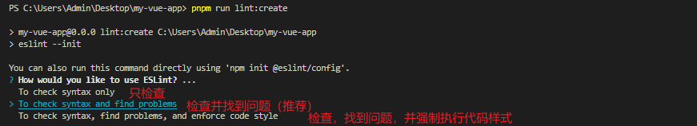
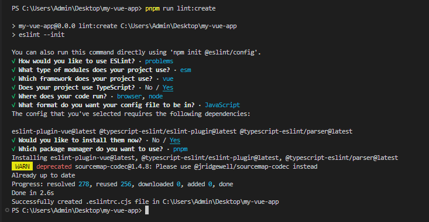

# engineering-vite-vue3-ts 项目搭建

## 1.项目采用 pnpm 的包管理工具，所以需要全局安装 pnpm

```bash
npm install pnpm -g
```

## 2.安装 vite

```bash
npm install -g vite
```

## 3.使用 vite3 创建项目（使用 vue-ts 模板）

```bash
pnpm create vite my-vue-app --template vue-ts
```

## 4.修改 vite-env.d.ts 文件

```javascript
/// <reference types="vite/client" />

declare module "*.vue" {
  import type { DefineComponent } from "vue";

  const component: DefineComponent<{}, {}, any>;
  export default component;
}
```

## 5.插件准备

插件：Stylelint、ESLint、Prettier - Code formatter

工作区插件配置：

```json
{
  "editor.formatOnSave": true,
  "editor.defaultFormatter": "esbenp.prettier-vscode",
  "editor.codeActionsOnSave": {
    "source.fixAll.eslint": true,
    "source.fixAll.stylelint": true
  },
  "stylelint.validate": ["css", "less", "scss", "vue"]
}
```

## 6.安装 eslint、prettier、相关校验规则依赖

```bash
pnpm install eslint eslint-plugin-vue eslint-config-prettier prettier eslint-plugin-import eslint-plugin-prettier eslint-config-airbnb-base -D
```

## 7.package.json 配置初始化 eslint 项目脚本，并执行

```json
"scripts": {
  "lint:create": "eslint --init",
},
```

### 1.执行 pnpm run lint:create

### 2.选择配置项





### 3.初始化 eslint 项目后，项目根目录会生成.eslintrc.cjs 文件，重写该文件

```javascript
module.exports = {
  env: {
    browser: true,
    es2021: true,
    node: true,
  },
  extends: ["plugin:vue/vue3-strongly-recommended", "airbnb-base", "prettier"],
  parser: "vue-eslint-parser",
  parserOptions: {
    ecmaVersion: 13,
    parser: "@typescript-eslint/parser",
    sourceType: "module",
    ecmaFeatures: {
      tsx: true,
      jsx: true,
    },
  },
  globals: {
    defineProps: "readonly",
    defineEmits: "readonly",
    defineExpose: "readonly",
    withDefaults: "readonly",
  },
  plugins: ["vue", "@typescript-eslint"],
  settings: {
    "import/resolver": {
      alias: {
        map: [["@", "./src"]],
      },
    },
    "import/extensions": [".js", ".jsx", ".ts", ".tsx", ".mjs"],
  },
  rules: {
    "import/no-extraneous-dependencies": 0,
    "no-param-reassign": 0,
    "vue/multi-word-component-names": 0,
    "vue/attribute-hyphenation": 0,
    "vue/v-on-event-hyphenation": 0,
  },
};
```

### 4.项目根目录下新增.eslintrcignore 文件，取消对不必要文件的校验

```
*.sh
node_modules
*.md
*.woff
*.ttf
.vscode
.idea
dist
/public
/docs
.husky
/bin
.eslintrc.js
prettier.config.js
/src/mock*

# logs
*.log
npm-debug.log*
yarn-debug.log*
yarn-error.log*
pnpm-debug.log*
lerna-debug.log*

.DS_Store
dist-ssr
*.local

/cypress/videos/
/cypress/screenshots/

# Editor directories and files
.vscode
!.vscode/extensions.json
.idea
*.suo
*.ntvs*
*.njsproj
*.sln
*.sw?

components.d.ts
```

### 5.安装 eslint-import-resolver-alias @types/eslint @types/node 依赖

```bash
pnpm install eslint-import-resolver-alias @types/eslint @types/node -D
```

eslint-import-resolver-alias 使项目中支持通过别名 import、支持 import 自定义类型的文件

@types/eslint 是 eslint 的类型定义包，@types/node 是 node 的类型定义包，这些包用来加载所有的定义类型（当你在项目中使用 ts 引入了一些包时，如果他们默认不包含类型，就必须添加他们的类型定义包）

### 6.安装 vite-plugin-eslint 插件并配置

1.安装插件

```bash
pnpm install vite-plugin-eslint -D
```

2.配置 vite.config.ts 文件使用 vite-plugin-eslint 插件（该插件能在开发的过程中在页面实时显示代码格式或语法的错误）

```javascript
import { defineConfig } from "vite";
import vue from "@vitejs/plugin-vue";
import eslintPlugin from "vite-plugin-eslint";

// https://vitejs.dev/config/
export default defineConfig({
  plugins: [vue(), eslintPlugin()],
  server: {
    host: "localhost",
    port: 9999,
    open: true,
  },
});
```

### 7.配置 package.json，eslint 校验并修复代码脚本

```json
"scripts": {
  "lint": "eslint \"src/**/*.{js,vue,ts}\" --fix"
},
此时可以运行pnpm run lint来校验并修复存在代码格式或语法错误的文件
（此时的pnpm run lint修复的代码可能会与编辑器prettier插件自动保存时的风格存在冲突）
```

### 8.解决 eslint 与 prettier 的校验规则冲突

1.项目根目录下新增.prettierrc.cjs 文件，并写入内容：

```javascript
module.exports = {
  printWidth: 100, // 最大行长规则通常设置为 100 或 120
  tabWidth: 2, // 指定每个标签缩进级别的空格数
  useTabs: false, // 使用制表符而不是空格缩进行
  semi: false, // true（默认）: 在每条语句的末尾添加一个分号。false：仅在可能导致 ASI 失败的行的开头添加分号
  singleQuote: true, // 使用单引号而不是双引号
  quoteProps: "as-needed", // 引用对象中的属性时，仅在需要时在对象属性周围添加引号
  jsxSingleQuote: false, // 在 JSX 中使用单引号而不是双引号
  trailingComma: "es5", // "none":没有尾随逗号。"es5": 在 ES5 中有效的尾随逗号（对象、数组等），TypeScript 中的类型参数中没有尾随逗号。"all"- 尽可能使用尾随逗号
  bracketSpacing: true, // 在对象文字中的括号之间打印空格
  arrowParens: "always", // 在唯一的箭头函数参数周围始终包含括号
  // 格式化文件范围是文件的全部内容
  rangeStart: 0,
  rangeEnd: Infinity,
  requirePragma: false, // 需要编译指示
  insertPragma: false, // 插入编译指示
  proseWrap: "never", // 如果散文超过打印宽度，则换行
  htmlWhitespaceSensitivity: "css", // 根据显示样式决定 html 要不要折行
  endOfLine: "lf", // 确保在文本文件中仅使用 ( \n)换行，常见于 Linux 和 macOS 以及 git repos 内部
  // vueIndentScriptAndStyle: true, // Vue 文件脚本和样式标签缩进
  // bracketSameLine: false, // 将>多行 HTML（HTML、JSX、Vue、Angular）元素放在最后一行的末尾，而不是单独放在下一行（不适用于自闭合元素）
};
```

2.项目根目录下新增.prettierignore 文件，取消对不必要文件的格式化

```
/dist/*
.local
.output.js
/node_modules/**
src/.DS_Store

**/*.svg
**/*.sh

/public/*
components.d.ts
```
