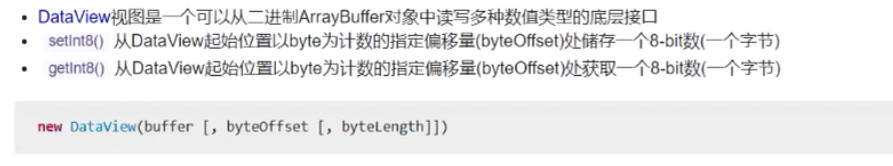
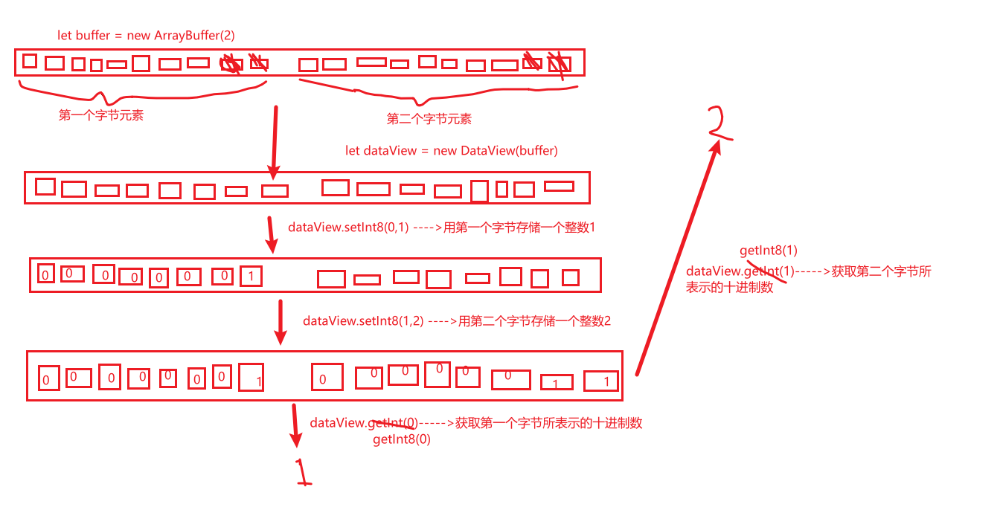

## 1. 认识文件类型家族图


## 2. FileReader

> 1.HTML5 定义了 FileReader 作为文件 API 的重要成员用于读取文件
> 2.FileReader.readAsDataURL()方法，在读取指定的 Blob/File 中的内容后，一旦完成，FileReader 实例对象的 result 属性中将包含一个 data:
> URL 格式的 Base64 字符串以表示所读取文件的内容
> 3.FileReader.readAsArrayBuffer()方法，在读取指定的 Blob/File 中的内容后，一旦完成，FileReader 实例对象的 result 属性中将包含一个 ArrayBuffer 的二进制数据缓冲区
> 4.FileReader.readAsText()方法，在读取指定的 Blob/File 中的内容后，一旦完成，FileReader 实例对象的 result 属性中将包含一个文本（文本的编码格式可设置，一般为 utf-8）
> 5.base64 格式的字符串图片可作为 url 显示图片，所以 FileReader 可以实现图片预览

### 2.1 利用 FileReader 读取图片，返回 base64 格式的数据，显示图片

```html

<button
  type="primary"
  @click="
          getBase64(
            'https://img0.baidu.com/it/u=2517394238,2890851596&fm=26&fmt=auto&gp=0.jpg'
          )
        "
>
  利用FileReader读取图片，返回base64格式的数据，显示图片
</button>
```

```javascript
  //=========================请求图片并预览
  base64Img: any = null
  getBase64(imgUrl: string): any {
    //判断浏览器是否支持FileReader
    if (window.FileReader) {
      return new Promise((resolve) => {
        fetch(imgUrl)
          .then((respone) => respone.blob()) //blob()是fetch中的方法,返回获取到的Blob内容
          .then((blob) => {
            let reader = new FileReader()
            let _this = this
            reader.onloadend = function () {
              console.log(reader.result)
              _this.base64Img = reader.result
              resolve(reader.result)
            }
            reader.readAsDataURL(blob)
          })
          .catch((e) => {
            throw Error(e)
          })
      })
    } else {
      alert('FileReader Not supported by your browser!')
    }
  }
```

### 2.2 input 上传图片，FileReader 实现预览

```html
<div class="upload">
  <input
    type="file"
    multiple
    accept="image/png,image/jpeg,image/gif,/image/jpg"
    @change="selectImg"
  />
  <Icon type="md-add" class="upload-icon" />
</div>

```

```javascript
//=====================上传图片并预览
  base64List: any[] = []
  async selectImg(e: any): Promise<void> {
    let fileList = e.target.files
    let base64List = []
    for (let i = 0; i < fileList.length; i++) {
      base64List.push(await this.getbase64Img(fileList[i]))
    }
    this.base64List.push(...base64List)
    e.target.value = '' //置空input的value，可重复上传
  }
  getbase64Img(file: File): any {
    return new Promise((resolve) => {
      let reader = new FileReader()
      reader.onloadend = function (res: any) {
        resolve(res.target.result)
      }
      reader.readAsDataURL(file)
    })
  }
```

## 3. ArrayBuffer

> 1.ArrayBuffer 对象是最底层的一个能够存储固定长度二进制数据的二进制数据缓冲区；
>
> 2.ArrayBuffer 对象是一个字节数组，它的元素就是字节（这里要知道一个字节是 8 个位，也就是 8 个 bit），通常在其它语言中称为 byte array
>
> 3.我们是不能直接操作 ArrayBuffer 对象的内容的，而是要通过 类型数组对象(TypeArray) 或 DateView 对象来操作，它们会将 ArrayBuffer 的内容表示为特定的格式，并通过这些格式来读写内容

```javascript
//==============================================================ArrayBuffer
buffer = new ArrayBuffer(8); //创建一个8字节长度的ArrayBuffer
// console.log(this.buffer.byteLength) //8,因为ArrayBuffer是字节数组，它的元素就是字节，所以有多少字节长度就为多少
```

## 4. TypeArray(类型数组)

> 1.TypeArray 能够把 ArrayBuffer 当成数组来操作
>
> 2.TypeArray 它本身是不可以被实例化的，甚至无法访问，可以把他理解为接口，它有很多类型：Int8Array，Uint8Array，Int16Array，Uint16Array
>
> 
>
> 这里解释一下有符号和无符号的区别：
>
> 因为 TypeArray 操作的是二进制数据，所以 Int8Array 或 Uint8Array 表示的是 8 位的二进制数，8 位也就是最大只能是占 8 个位也就是一个字节，但是由于二进制的数据只能用 0 或 1 来表示，每一个 0 或 1 都占一个位，所以在 Uint8Array 中最大的 8 位的二进制数就是 11111111,转化成十进制数就是 255，所以无符号时 Uint8Array 最大能表示的十进制数是 255，00000000 表示的是最小的十进制数 0。
>
> 但是要想表示负数，在 Int8Array 中，所以就要将一个字节里面 8 个位中的最左边的位用来表示-，1 表示-号，0 表示+，所以后面 7 位所能表示最大的 8 位的二进制数为 01111111，也就是 127，10000000 表示的是最小的十进制数-128，11111111 表示十进制数是 0，01111111->11111111->10000000 表示的十进制数是 127 -> 0 -> -128（Int16 和 Uint16 也是这个道理）。
>
> 3.也就是说 TypeArray 能把 ArrayBuffer 化作不同类型的数组来进行读写
>
> 4.int8Array/uint8Array/int16Array/uint16Array.buffer === arrayBuffer，也就是说.buffer 可以获取到原来的 ArrayBuffer

```javascript
//===============================================================TypeArray
//1.Int8Array
buffer1 = new ArrayBuffer(8); //创建一个8字节长度的ArrayBuffer
int8Array1 = new Int8Array(this.buffer1); //创建一个带符号的8位的数组（也就是每一个元素占8个位，就是一字节，也可以和ArrayBuffer一样叫字节数组）
// console.log(this.int8Array1.length) //8,因为Int8Array是字节数组，它的元素就是字节，所以有多少字节长度就为多少
// console.log(this.int8Array1.buffer === this.buffer1) //true

//2.Int16Array
int16Array1 = new Int16Array(this.buffer1); //创建一个带符号的16位的数组（也就是每一个元素占16个位，就是2个字节，也可叫二字节数组）
// console.log(this.int16Array1.length)//4,因为Int16Array是二字节数组，它的每个元素占两个字节，所以 字节数/2 就是它的长度
// console.log(this.int16Array1.buffer === this.buffer1) //true

//3.Int32Array...
```

## 5. DataView

> 1.DataView 是一个可以把 ArrayBuffer 作为任意类型的 TypeArray 进行读写
>
> 
>
> 2.dataView.setInt8(第几个字节(说的是索引),设置的数(这里说的是十进制的数))，说的意思是将该索引的字节存储一个十进制的数字
>
> 3.dataView.getInt8(第几个字节(说的是索引))，返回的是该索引字节所存储的十进制数字
>
> 4.dataView.setInt16(第几个双字节(说的是索引),设置的数(这里说的是十进制的数))，说的意思是将该索引的双字节存储一个十进制的数字
>
> 5.dataView.getInt16(第几个双字节(说的是索引))，返回的是该索引字节所存储的十进制数字
>
> 6.dataView.buffer === araybuffer，也就是说.buffer 可以获取到原来的 ArrayBuffer
>
> 7.setInt8() 、 getInt8()...理解图如下：
>
> 

```javascript
//=================================================================DataView
buffer2 = new ArrayBuffer(2); //2个字节的ArrayBuffer
dataView2 = new DataView(this.buffer2);
//dataView2.setInt8(0,1)
//dataView2.setInt8(1,2)
//console.log(this.dataView2.getInt8(0)) //1
//console.log(this.dataView2.getInt8(1)) //2
//console.log(this.dataView2.getInt16(0)) //258，getInt16(0)就是获取第一个双字所表示的十进制数字，与getInt8(0)不同的就是getInt16(0)获取的是第一个字节所表示的十进制数字

//console.log(this.dataView2.buffer === this.buffer2) //true
```

## 6. Blob

> 1.Blob 表示二进制类型的大对象（input 框上传文件的 File 对象就是基于 Blob 实现的,也就是 File 是 Blob 的子类）
>
> 2.Blob 对象可以存储二进制数据，可以把他看成是一个存储二进制文件的容器
>
> 3.生成 Blob 对象有两种方法，1.通过 Blob 构造函数；2.通过 Blob 的 slice 方法从一个 Blob 对象中切割出一个新的 Blob 对象
>
> 4.Blob 构造函数可以接收两个参数，new Blob(array[,options])，array 可以是由 ArrayBuffer、DataView、TypeArray、Blob、File、DomString 等对象构成的数组

### 6.1 将 blob 转化为其它格式数据

```html
<button type="primary" @click="handleReadBlob">将blob转化为其它格式数据</button>
```

```javascript
//=================================================================Blob
  data3 = { name: 'xiaopihong' }
  str3 = JSON.stringify(this.data3)
  blob3 = new Blob([this.str3], { type: 'application/json' })
  //console.log(this.blob3.size) //21,就是json字符串的长度
  //同一个blob可以被读成多种类型
  readBlob(blob: Blob, type: string): Promise<void> {
    return new Promise(function (resolve) {
      let reader = new FileReader()
      reader.onloadend = function (event: any) {
        // console.log(reader.result) //或者这里直接resolve(render.result)，也就是resolve(event.target.result)
        resolve(event.target.result)
      }
      switch (type) {
        case 'ArrayBuffer':
          reader.readAsArrayBuffer(blob) //读成ArrayBuffer格式
          break
        case 'DataURL':
          reader.readAsDataURL(blob) //读成DataURL格式，DataURL就是base64格式的字符串数据
          break
        case 'Text':
          reader.readAsText(blob, 'utf-8') //读成utf-8的文本格式
          break
        default:
          break
      }
    })
  }
  handleReadBlob(): void {
    this.readBlob(this.blob3, 'ArrayBuffer').then((result) => {
      console.log(result)
    })
    this.readBlob(this.blob3, 'DataURL').then((result) => {
      console.log(result)
    })
    this.readBlob(this.blob3, 'Text').then((result) => {
      console.log(result)
    })
  }

```

## 7. Object URL

> 1.Object URL 说的是浏览器的 URL 对象，我们可以通过这个对象的方法来生成一个 url 来表示 Blob 数据
>
> 2.URL.createObjectURL(Blob/File)静态方法会创建一个 DOMString,其中包含一个表示参数中给出的对象 URL，这个 URL 和窗口中的 document 绑定，URL 对象表示指定的 Blob 对象或 File 对象
>
> 3.URL.revokeObjectURL(Object URL)静态方法用来释放一个之前已经存在的，通过调用 createObjectURL 创建的 URL 对象，也就是销毁 Object Url，同时也会销毁 Blob

### 7.1 点击通过 Object URL 下载 json 文件

```html
<button type="primary" @click="downloadByObjectURL">
  点击通过Object URL下载json文件
</button>
```

```javascript
 //=================================================================Object URL
  downloadByObjectURL(): void {
    let data = { name: 'xiaopihong' }
    let str = JSON.stringify(data)
    let blob = new Blob([str], { type: 'application/json' })
    let a = document.createElement('a')
    a.download = 'user.json'
    a.rel = 'noopener' //不打开
    let url = URL.createObjectURL(blob)
    a.href = url //Object URL可赋值给src url href
    a.dispatchEvent(new MouseEvent('click'))
    URL.revokeObjectURL(url) //销毁Object URL，然后会销毁blob
  }
```
