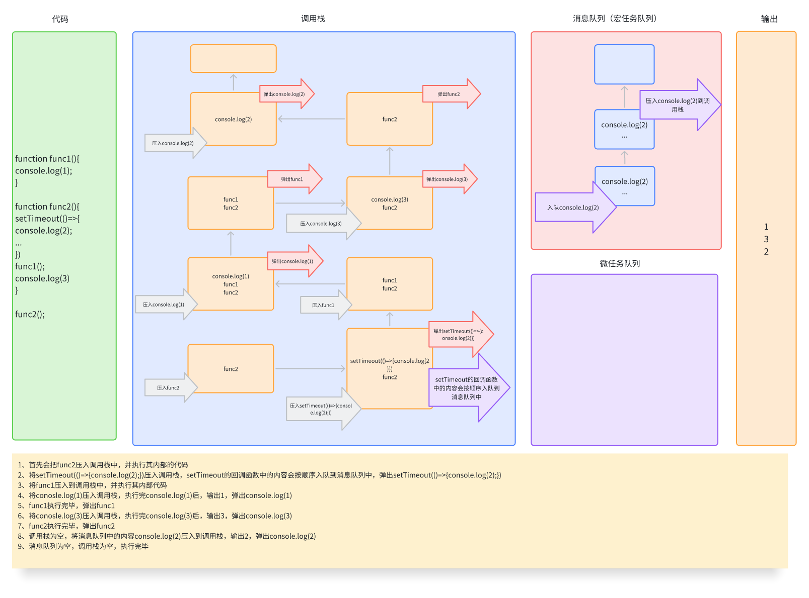
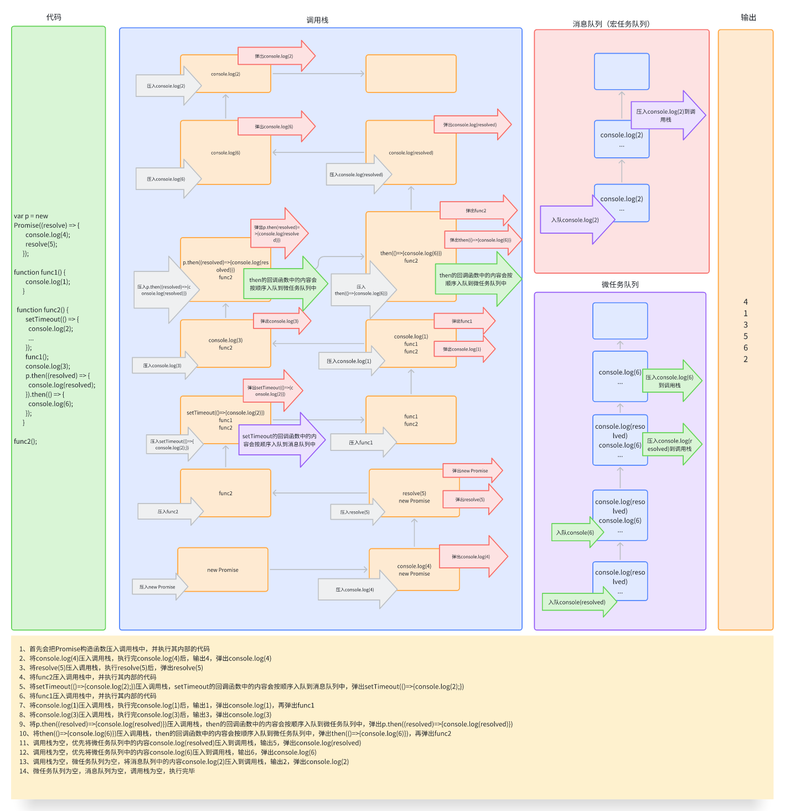

# 事件循环机制（Event Loop）

## event loop

js是一门单线程的语言，它的异步和多线程是通过Event Loop事件循环机制来实现的。大体由以下几部分组成：
- 调用栈（call stack）
- 消息队列（Message Queue）
- 微任务队列（Microtask Queue）

## event loop的执行

eventloop开始时会从全局的代码一行一行往下执行，遇到函数调用，会把函数压入到调用栈中，被压入的函数叫做帧（Frame），当被压入的函数 return 返回后会从调用栈中弹出。

## 案例1（不涉及队列）

## 案例2（涉及消息队列）

js中的异步操作，如：fetch、事件回调、（setTimeout、sesetInterval中的回调函数）会入队到消息队列中（宏任务队列），为消息，消息会在调用栈清空的时候压入到调用栈中执行，这也是为什么setTimeout中的延迟参数只是最小延迟时间。

## 案例3（涉及消息队列、微任务队列）
持有promise、async、await创建的异步操作会加入到微任务队列中，它会在调用栈在清空的时候立即执行，并且处理期间加入的微任务也会一同执行。

## 总结

微任务队列中的内容要比消息队列（宏任务队列）中的内容优先执行。

