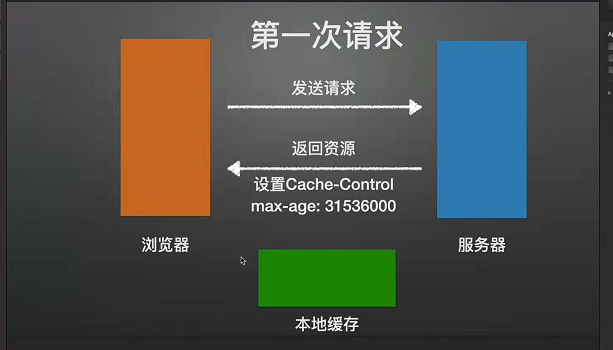
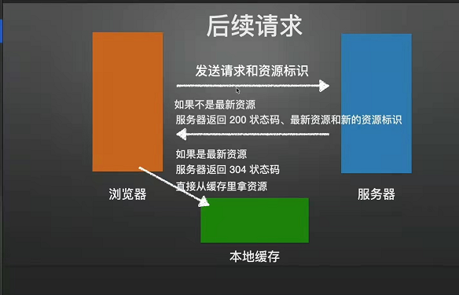
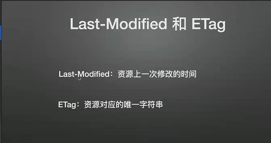
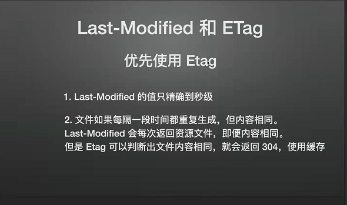

# Http 缓存

## 1.强制缓存

1.1.可以在服务器的 nginx 配置文件中配置响应头：(Chache-Control:max-age=300) 这个用户在第一次访问网站时，就会强制缓存下对应的浏览器觉得能缓存的文件

1.2.下次再次访问相同的网站时，浏览器会判断(Chache-Control:max-age=300)中的 max-age（最大有效时间，单位为秒）是否过期，没过期的话会从浏览器的缓存中拿对应的文件，而不会重新发送 http 请求去获取资源

1.3.从浏览器缓存中获取的资源获取回来的状态码还是 200，但是状态码右侧会显示是从浏览器缓存中获取的(from prefetch cache)

1.4.如果不想浏览器用这种强制缓存策略，可以设置响应头：(Chache-Control:no-cache)

## 2.协商缓存（前提条件是服务器 nginx 设置是可以缓存的资源）

2.1.是服务端的一种缓存策略

2.2.用户在访问网站请求资源的时候会发送资源标识给服务器，如果服务器的资源标识和请求时候传过来的资源标识不一样（包含未请求过的情况），服务器就会返回 200 状态码、当前资源和当前资源最新的资源标识，相当于是一次完整的请求，请求体积大；如果服务器的资源标识和请求时候传过来的资源标识一致，服务器就会响应 304 的 http 状态码，浏览器就会自动的去缓存中拿该资源，服务器只返回 304 状态码，请求体积小

## 3.协商缓存资源标识

3.1.标识有两种：Last-Modified（资源上一次修改的时间） 和 ETag（资源对应的唯一字符串）

3.2.例子：客户端访问资源时如果该资源可以缓存，就把 Last-Modified 和资源一起返回到客户端，客户端存起来，再次请求该资源的时会把该资源的 Last-Modified 发送给服务端，服务端判断 Last-Modified 是否一致来响应 200/304 状态码，如果 200 状态码，浏览器就重新存储这个 Last-Modified 和资源，如果 304 状态码，浏览器会去缓存中获取资源

3.3.浏览器发送给服务器的 Last-Modified 用的是另外的请求头键名：If-Modified-Since

3.4.ETag 和 Last-Modified 是同理的，只不过 ETag 是一串无意义的唯一字符串

3.5.浏览器发送给服务器的 ETag 用的是另外的请求头键名：If-None-Match

3.6.ETag 和 Last-Modified 用哪个？

## 4.总结

[视频总结](https://www.bilibili.com/video/BV1dU4y1J7es?p=1&share_medium=android&share_plat=android&share_source=WEIXIN&share_tag=s_i&timestamp=1655887869&unique_k=TwGhvtp)
