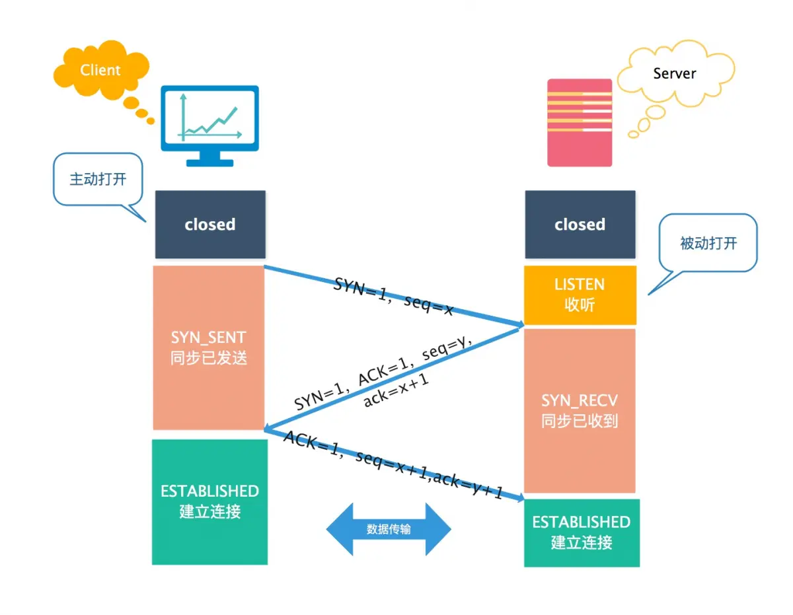
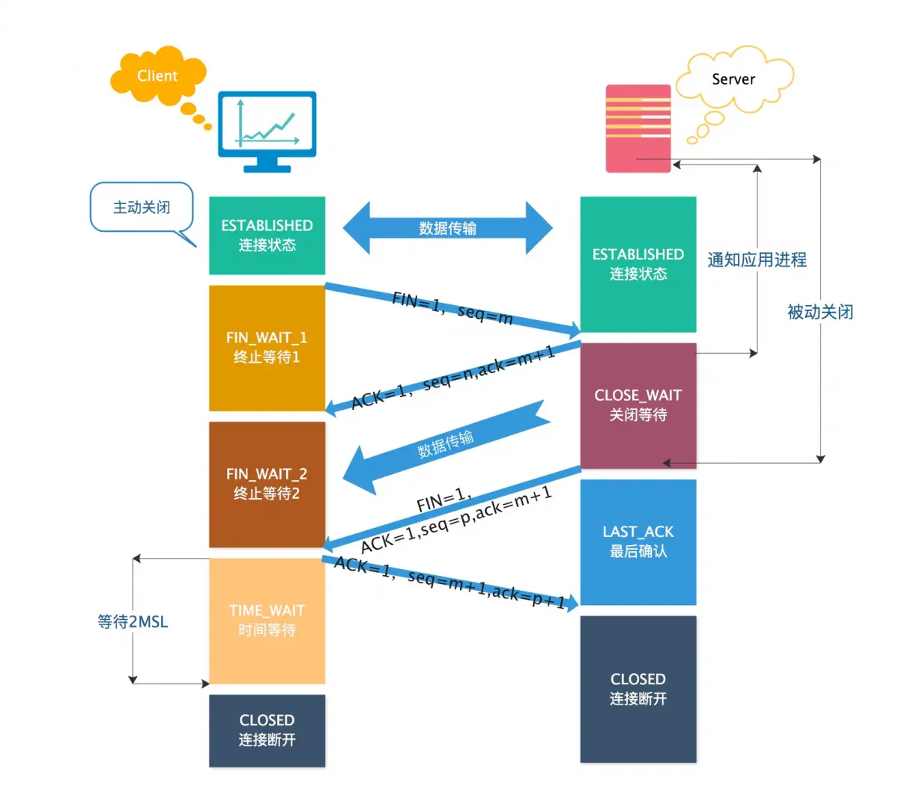

# 三次握手和四次挥手以及 TCP 标志位的详细介绍

## 一、TCP 标志位

在讲 TCP 三次握手和四次挥手之前，先说一下 TCP 标志位，方便后续的理解。

简单来说，TCP 标志位的值代表了当前请求的目的。

标志位一共有 6 种，分别是：

1. SYN(synchronous)： 发送/同步标志，用来建立连接，和下面的第二个标志位 ACK 搭配使用。连接开始时，SYN=1，ACK=0，代表连接开始但是未获得响应。当连接被响应的时候，标志位会发生变化，其中 ACK 会置为 1，代表确认收到连接请求，此时的标志位变成了 SYN=1，ACK=1。
2. ACK(acknowledgement)：确认标志，表示确认收到请求；
3. PSH(push) ：表示推送操作，就是指数据包到达接收端以后，不对其进行队列处理，而是尽可能的将数据交给应用程序处理；
4. FIN(finish)：结束标志，用于结束一个 TCP 会话；
5. RST(reset)：重置复位标志，用于复位对应的 TCP 连接；
6. URG(urgent)：紧急标志，用于保证 TCP 连接不被中断，并且督促中间层设备尽快处理。

此外，还有两个序号：

1. Sequence number ：顺序号，发送数据包中的第一个字节的序列号，一般为小写的 seq。
2. Acknowledge number：确认号，响应前面的 seq，值为 seq+1，可以理解为期望下次发出的序列号为 seq+1。

## 二、TCP 三次握手

### 1.TCP 三次握手概述

所谓三次握手(Three-way Handshake)，是指建立一个 TCP 连接时，需要客户端和服务器总共发送 3 个包。 三次握手的目的是连接服务器指定端口，建立 TCP 连接,并同步连接双方的顺序号和确认号并交换 TCP 信息

### 2.图解 TCP 三次握手

- 第一次握手：客户端 Client 发送位码为 SYN ＝ 1，随机产生 seq=x 的数据包到服务器，服务器 Server 由 SYN=1 知道，客户端 Client 要求建立联机；

- 第二次握手：服务器 Server 收到请求后要确认联机信息，向客户端 Client 发送 ack=(客户端 Client 请求连接时的 seq)+1，SYN=1，ACK=1，产生 seq=y 的包,代表接收到连接请求并且向客户端再次确认；

- 第三次握手：客户端 Client 收到后检查 ack 是否正确，即第一次发送的 seq+1，以及位码 ACK 是否为 1，代表收到了服务器端发过来的确认信息。之后客户端 Client 会再向服务器发送 ack=(服务器 Server 的 seq+1)，ACK=1，服务器 Server 收到后确认 ack 值与 ACK=1，连接建立成功。

### 3.针对 TCP 连接的安全问题：SYN 攻击

- 危害：SYN 攻击属于 DOS 攻击的一种，它利用 TCP 协议缺陷，通过发送大量的半连接请求，耗费 CPU 和内存资源。SYN 攻击除了能影响主机外，还可以危害路由器、防火墙等网络系统，事实上 SYN 攻击并不管目标是什么系统，只要这些系统打开 TCP 服务就可以实施。

- 原理：在三次握手过程中，服务器发送 SYN-ACK（确认收到客户端请求的连接）之后，收到客户端的 ACK（第三个包）之前的 TCP 连接称为半连接(half-open connect).此时服务器处于 SYN_RECV（等待客户端相应）状态，如果接收到客户端的 ACK，则 TCP 连接成功，如果未接受到，则会重发请求直至成功。SYN 攻击就是 攻击客户端 在短时间内伪造大量不存在的 IP 地址，向服务器不断地发送 SYN 包，服务器回复确认包，并等待客户的确认，由于源地址是不存在的，服务器需要不断的重发直 至超时，这些伪造的 SYN 包将长时间占用未连接队列，影响了正常的 SYN，目标系统运行缓慢，严重者引起网络堵塞甚至系统瘫痪。

- 检测：检测 SYN 攻击非常的方便，当在服务器上看到大量的半连接状态时，特别是源 IP 地址是随机的，基本上可以断定这是一次 SYN 攻击。

- 防范：主要有两大类，一类是通过防火墙、路由器等过滤网关防护，另一类是通过加固 TCP/IP 协议栈防范.但必须清楚的是，SYN 攻击不能完全被阻止，我们所做的是尽可能的减轻 SYN 攻击的危害，除非将 TCP 协议重新设计。

过滤网关防护：

1. 网关超时设置
2. SYN 网关
3. SYN 代理

加固 TCP/IP 协议栈：

1. SynAttackProtect 机制
2. SYN cookies 技术
3. 增加最大半连接数
4. 缩短超时时间

## 三、图解 TCP 四次挥手

1. 客户端 Client 进程发出连接释放报文，并且停止发送数据。其中 FIN=1，顺序号为 seq=m（等于前面已经传送过来的数据的最后一个字节的序号加 1），此时，客户端 Client 进入 FIN-WAIT-1（终止等待 1）状态。 TCP 规定，FIN 报文段即使不携带数据，也要消耗一个序号。

2. 服务器 Server 收到连接释放报文，发出确认报文，ACK=1，ack=m+1，并且带上自己的顺序号 seq=n，此时，服务器 Server 就进入了 CLOSE-WAIT（关闭等待）状态。TCP 服务器通知高层的应用进程，客户端 Client 向服务器的方向就释放了，这时候处于半关闭状态，即客户端 Client 已经没有数据要发送了，但是服务器 Server 若发送数据，客户端 Client 依然要接受。这个状态还要持续一段时间，也就是整个 CLOSE-WAIT 状态持续的时间。

3. 客户端 Client 收到服务器 Server 的确认信息后，此时，客户端 Client 就进入 FIN-WAIT-2（终止等待 2）状态，等待服务器 Server 发送连接释放报文（在这之前还需要接受服务器 Server 发送的最后的数据）。

4. 服务器 Server 将最后的数据发送完毕后，就向客户端发送连接释放报文，FIN=1，ack=m+1，由于在半关闭状态，服务器 Server 很可能又发送了一些数据，假定此时的顺序号为 seq=p，此时，服务器 Server 就进入了 LAST-ACK（最后确认）状态，等待客户端 Client 的确认。

5. 客户端 Client 收到服务器 Server 的连接释放报文后，必须发出确认，ACK=1，ack=p+1，而自己的顺序号是 seq=m+1，此时，客户端 Client 就进入了 TIME-WAIT（时间等待）状态。注意此时 TCP 连接还没有释放，必须经过 2\*MSL（最长报文段寿命）的时间后，当客户端 Client 撤销相应的 TCB（保护程序）后，才进入 CLOSED 状态。

6. 服务器 Server 只要收到了客户端 Client 发出的确认，立即进入 CLOSED 状态。同样，撤销 TCB 后，就结束了这次的 TCP 连接。可以看到，服务器 Server 结束 TCP 连接的时间要比客户端 Client 早一些。

## 四、常见面试题

### 1. 为什么连接的时候是三次握手，关闭的时候却是四次握手？

答：因为当客户端发起关闭连接的请求时，发出的 FIN，仅代表客户端没有需要发送给服务器端的数据了。而如果服务器端如果仍有数据需要发送给客户端的话，响应报文 ACK 和结束报文 FIN 则就不能同时发送给客户端了。此时，服务器端会先返回一个响应报文，代表接收到了客户端发出的 FIN 请求，而后在数据传输完了之后，再发出 FIN 请求，表示服务器端已经准备好断开连接了。所以关闭连接的时候是四次握手。

### 2. 为什么 TIME_WAIT 状态需要经过 2MSL(最大报文段生存时间)才能返回到 CLOSE 状态？

答：按照前面所说，当四个报文全部发送完毕后，理论上就算是结束了。但是实际情况往往不会那么可靠，比如最后一条报文发出后丢失了，那么服务器端就不会接收到这一报文，每隔一段时间，服务器端会再次发出 FIN 报文，此时如果客户端已经断开了，那么就无法响应服务器的二次请求，这样服务器会继续发出 FIN 报文，从而变成了死循环。所以需要设置一个时间段，如果在这个时间段内接收到了服务器端的再次请求，则代表客户端发出的 ACK 报文没有接收成功。反之，则代表服务器端成功接收响应报文，客户端进入 CLOSED 状态，此次连接成功关闭。而这个时间，就规定为了 2MSL，即客户端发出 ACK 报文到服务器端的最大时间 + 服务器没有接收到 ACK 报文再次发出 FIN 的最大时间 = 2MSL

### 3. 为什么不能用两次握手进行连接？

答：三次握手有两个重要的功能，一是要双方做好发送数据的准备工作且双方都知道彼此已准备好，二要允许双方就初始顺序号进行协商，这个顺序号在握手过程中被发送和确认。如果改为了两次握手，是有可能发生死锁的。在两次握手的设定下，服务器端在成功接受客户端的连接请求 SYN 后，向客户端发出 ACK 确定报文时，如果因为网络原因客户端没有接收到，则会一直等待服务器端的 ACK 报文，而服务器端则认为连接成功建立了，便开始向客户端发送数据。但是客户端因为没有收到服务器端的 ACK 报文，且不知道服务器的顺序号 seq，则会认为连接未成功建立，忽略服务器发出的任何数据。如此客户端一直等待服务器端的 ACK 报文，而服务器端因为客户端一直没有接收数据，而不断地重复发送数据，从而造成死锁。

### 4. 如果已经建立了连接，但是客户端突然出现故障了怎么办？

答：TCP 还设有一个保活计时器，显然，客户端如果出现故障，服务器不能一直等下去，白白浪费资源。服务器每收到一次客户端的请求后都会重新复位这个计时器，时间通常是设置为 2 小时，若两小时还没有收到客户端的任何数据，服务器就会发送一个探测报文段，以后每隔 75 秒钟发送一次。若一连发送 10 个探测报文仍然没反应，服务器就认为客户端出了故障，接着就关闭连接。
