# Performance 工具

Performance 工具是用于分析和优化网页或应用性能的工具，帮助开发者诊断页面加载速度、渲染性能、内存消耗等问题。通过使用这些工具，开发者可以识别并修复影响性能的瓶颈，提供更流畅的用户体验。

## Chrome 的 Performance 工具

通过一个经典的案例来实践这个工具：[demo](https://googlechrome.github.io/devtools-samples/jank/)（该 demo 可能需要科学上网）

### 控制面板

- `Disable JS Samples`：开启后，火焰图只会精确到事件级别（调用某个 JS 文件中的函数是一个事件），忽略该事件下的所有函数调用栈
- `CPU`：电脑的 cpu 性能 一般会高于移动设备，所以该功可以根据情况拉低 cpu 性能来进行分析
- `Hardware Concurrency`：表示系统中 CPU 核心或线程的数量，此功能用于指示浏览器或应用程序可以并行处理的任务数量
- `Extension data`：可能用于显示或记录扩展程序在网页上执行的操作或收集的相关数据。当你启用这个选项后，浏览器可能会追踪或显示与浏览器扩展相关的信息，例如：
  - 扩展与网页交互的请求或响应数据。
  - 扩展如何修改页面内容或注入脚本。
  - 扩展程序在页面上的额外性能开销。
- `Enable advanced paint instrumentation`：开启后会详细记录某些渲染事件的细节
- `Network`：网络环境的配置
- `Enable CSS selector stats(slow)`：开启后，浏览器或开发工具会统计页面中所有 CSS 选择器的使用情况，收集性能数据，比如每个选择器匹配 DOM 元素的次数以及可能的性能瓶颈。（此选项会增加浏览器的开销，因为每个选择器的使用情况都需要被跟踪和分析，这可能会导致页面加载速度变慢，尤其是选择器较多时）适用场景：
  - 主要用于 性能调优，如果你怀疑页面中的某些 CSS 选择器影响了性能，可以通过启用此选项，收集选择器匹配的统计数据。
  - 当 CSS 文件过于复杂或包含很多嵌套选择器时，开发者可以利用这些数据优化选择器的效率，减少性能开销。

### 概述面板

#### FPS

全称 Frames Per Second，表示每秒传输帧数，是速度单位，用来分析动画的一个主要性能指标。 如下图所示，红色线段代表 FPS 非常低，而绿色条越高，FPS 越高。（新版本的 chrome 没有显示 FPS 标识，只有帧率低的时候会显示红色条）

`帧数`（Frame Count）是指图像、视频或动画文件中包含的总帧数。每一帧代表一个静态画面，多个帧按顺序播放就形成了连续的视觉效果。帧数和帧率一起决定了视频的总时长和流畅度：

- 帧数 = 帧率 × 时长：比如一个 10 秒的 24 FPS 的视频帧数为 24 × 10 = 240 24×10=240 帧。

帧数越多，视频文件通常会更大，但也可以提供更高的分辨率或更细致的动作过程。

`帧率`（Frame Rate），也称为每秒帧数（Frames Per Second，FPS），是指图像、视频或动画中每秒钟所显示的帧数。帧率越高，画面越流畅，越接近人眼的视觉体验；帧率越低，画面会显得卡顿或不连贯。

常见的帧率包括：

- 24 FPS：常用于电影，因为这种帧率能带来略微的“电影感”。
- 30 FPS：常用于电视广播和一些视频内容，流畅度较高。
- 60 FPS：常用于高清视频、电子游戏和高要求的实时渲染，使画面更平滑。
- 120 FPS 及更高：用于高端游戏和高刷新率显示器，提供极致流畅的视觉体验。
- 帧率的选择通常取决于应用场景和硬件能力，例如在电影制作、游戏设计和虚拟现实等领域，帧率的需求各不相同。

#### CPU

CPU 资源占用情况。此面积图指示消耗 CPU 资源的事件类型。
下图中颜色分别为（与数据统计中的颜色数据表示一致）：

- 蓝色(Loading)：表示网络通信和 HTML 解析时间。
- 黄色(Scripting)：表示 JavaScript 执行时间。
- 紫色(Rendering)：表示样式计算和布局（重排）时间。
- 绿色(Painting)：表示重绘时间。
- 灰色(other)：表示其它事件花费的时间。
- 白色(Idle)：表示空闲时间（无痕模式就是黑色部分）。

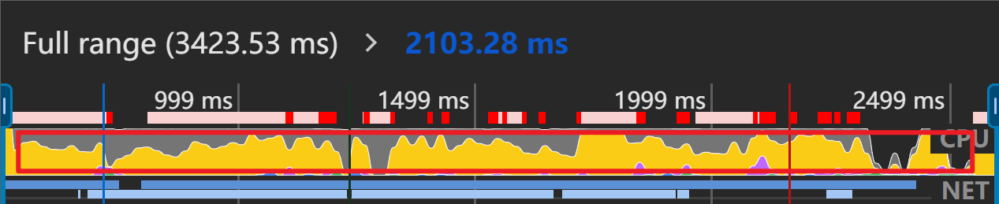

#### NET

Network 概览。深蓝色表示存在高优先级的资源请求的时间段，浅蓝色表示存在低优先级的资源请求的时间段。

Net 下方显示的是对应时间轴显示的图像

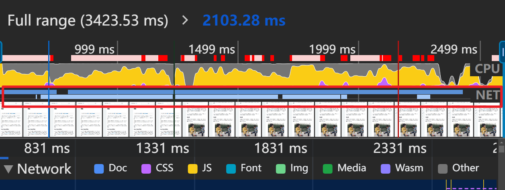

#### Network

可以看出网络请求的详细情况。调试 network 可以使用 DevTools 的 Network 面板

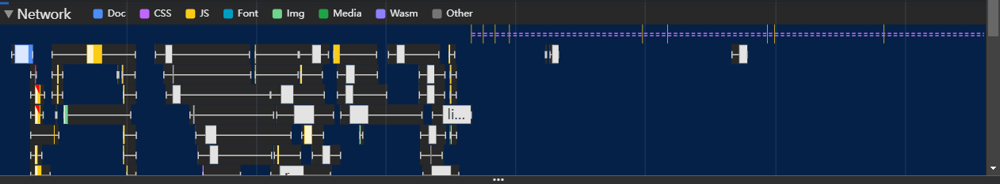

#### Frames

表示每帧的运行情况。将鼠标悬停在其中一个绿色方块上。DevTools 会显示特定帧的处理时长。根据 60 FPS 的标准 每帧的时间应该约为 16.7ms。通过这个可以判断 FPS 是否异常，以及那些帧存在问题。

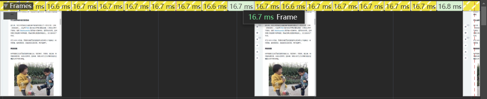

#### Timings

点击`开始并重新加载记录`时会显示此行，用于调试应用的首屏性能。

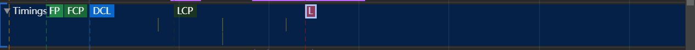

- FP（first paint）：首个像素开始绘制到屏幕上的时机，例如一个页面的背景色
- FCP（first contentful paint）：开始绘制内容的时机，如文字或图片
- LCP（Largest Contentful Paint）：视口内可见的最大内容元素的渲染时间
- FMP（First Meaningful Paint）：首次有意义的绘制
- DCL（DOMContentLoaded）：表示 HTML 已经完全被加载和解析
- L（Onload）:页面所有资源加载完成事件

#### Main

主线程活动。通过倒置的火焰图展示主线程上发生的活动，x 轴表示随时间的记录。y 轴代表调用堆栈。上层的事件调用（触发）了下层的事件（anonymous 代表匿名函数），火焰图顶层宽度越大就表示该活动可能存在性能问题。

每一个条形代表一个事件，条形越长，消耗时间越长。当看到图形堆叠，表示同一时间处理事件较高。可能会导致性能问题。面板中会有很多的 Task，如果是耗时长的 Task，其右上角会显示红色三角，这个时候就可以选中标红的 Task，定位到耗时函数，然后针对性去优化。

**查看长任务**

- 火焰图顶部（根部）由很多任务（Task）组成，使用灰色背景色区分。鼠标悬浮上去可以看到任务的总耗时。

**查看代码位置和执行时间**

- 通过某个 Task 下的代码块会对应显示该代码对应位置以及执行时间

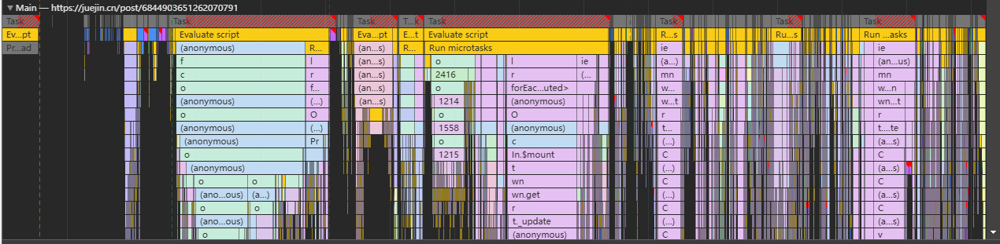

#### Thread pool

线程池
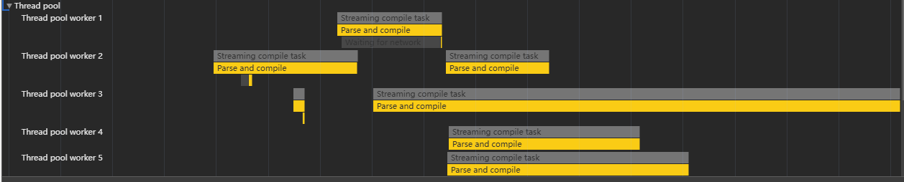

#### Details 详情

`Summary`： 各类型事件所消耗时长的饼状图总览。通过对比各项时长，可以判断是否存在异常。通常整体当中的 Idle 占比较多是比较期望的情况。如果其他内容占比较多，我们就可以去看一下它占比多的原因。

- 黄色(Scripting)：JavaScript 执行

- 紫色(Rendering)：样式计算和布局，即重排

- 绿色(Painting)：重绘

- 灰色(other)：其它事件

- 白色(Idle)：空闲

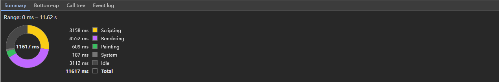

`Bottom-Up`：表示事件时长排序列表，可以查看花费最多时间的活动。

- Self Time：指除去子事件这个事件本身消耗的时间

- Total Ttime：这个事件从开始到结束消耗的时间（包含子事件）

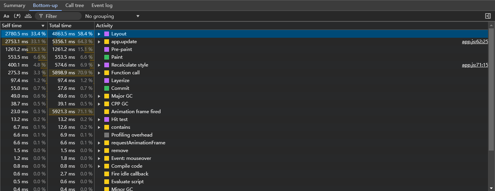

`Call Tree`：表示事件调用顺序列表，可以查看导致最多工作的根活动

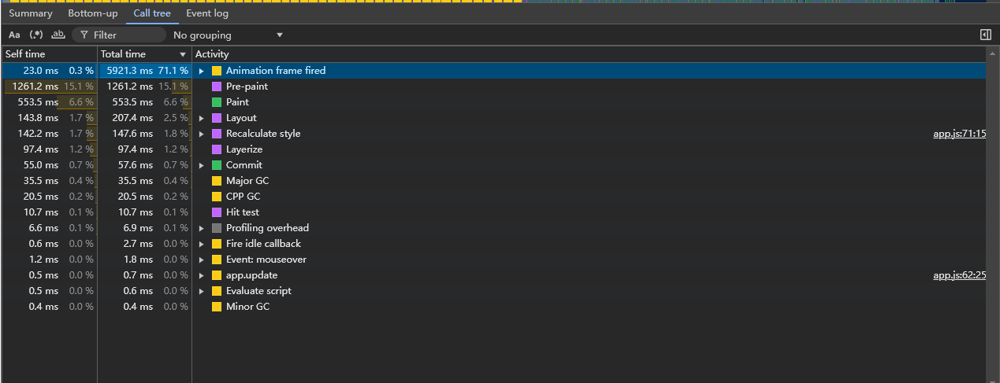

`Event Log`：表示事件发生的顺序列表，可以看到事件的开始触发时间 start time，根据记录期间的活动顺序查看活动，右边有事件描述信息

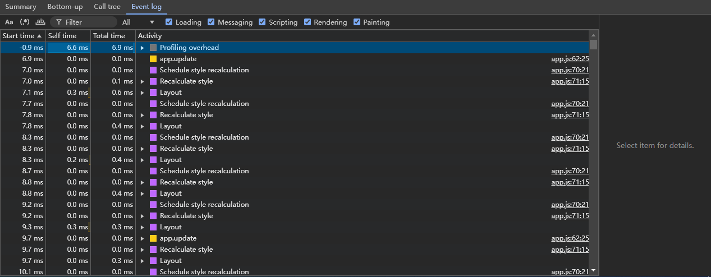

## 参考链接

- [Performance 使用指南前端性能排查](https://pengzhenglong.github.io/2023/03/31/Performance%E4%BD%BF%E7%94%A8%E6%8C%87%E5%8D%97%E5%89%8D%E7%AB%AF%E6%80%A7%E8%83%BD%E6%8E%92%E6%9F%A5/)
- [关于 Chrome DevTools Performance 的使用与分析](https://juejin.cn/post/7124197466991231007#heading-7)
- [狙杀页面卡顿 —— Performance 指北](https://juejin.cn/post/6844903651262070791#heading-0)
