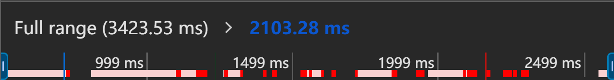

# Performance 工具

Performance 工具是用于分析和优化网页或应用性能的工具，帮助开发者诊断页面加载速度、渲染性能、内存消耗等问题。通过使用这些工具，开发者可以识别并修复影响性能的瓶颈，提供更流畅的用户体验。

## Chrome 的 Performance 工具

通过一个经典的案例来实践这个工具：[demo](https://googlechrome.github.io/devtools-samples/jank/)（该 demo 可能需要科学上网）

### 控制面板

- `Disable JS Samples`：开启后，火焰图只会精确到事件级别（调用某个 JS 文件中的函数是一个事件），忽略该事件下的所有函数调用栈
- `CPU`：电脑的 cpu 性能 一般会高于移动设备，所以该功可以根据情况拉低 cpu 性能来进行分析
- `Hardware Concurrency`：表示系统中 CPU 核心或线程的数量，此功能用于指示浏览器或应用程序可以并行处理的任务数量
- `Extension data`：可能用于显示或记录扩展程序在网页上执行的操作或收集的相关数据。当你启用这个选项后，浏览器可能会追踪或显示与浏览器扩展相关的信息，例如：
  - 扩展与网页交互的请求或响应数据。
  - 扩展如何修改页面内容或注入脚本。
  - 扩展程序在页面上的额外性能开销。
- `Enable advanced paint instrumentation`：开启后会详细记录某些渲染事件的细节
- `Network`：网络环境的配置
- `Enable CSS selector stats(slow)`：开启后，浏览器或开发工具会统计页面中所有 CSS 选择器的使用情况，收集性能数据，比如每个选择器匹配 DOM 元素的次数以及可能的性能瓶颈。（此选项会增加浏览器的开销，因为每个选择器的使用情况都需要被跟踪和分析，这可能会导致页面加载速度变慢，尤其是选择器较多时）适用场景：
  - 主要用于 性能调优，如果你怀疑页面中的某些 CSS 选择器影响了性能，可以通过启用此选项，收集选择器匹配的统计数据。
  - 当 CSS 文件过于复杂或包含很多嵌套选择器时，开发者可以利用这些数据优化选择器的效率，减少性能开销。

### 概述面板

