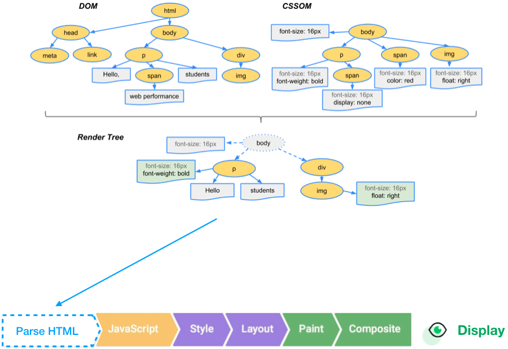
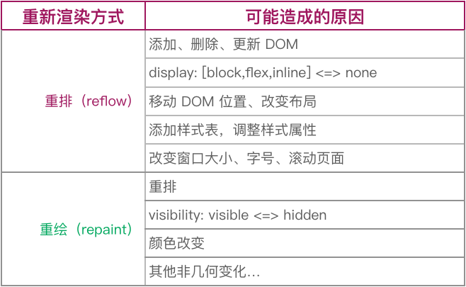

# 浏览器渲染机制

### 浏览器如何渲染 html

**浏览器在接收到 html 文件后，会分几个步骤将 html 文件转化成界面，这个过程就是渲染。**

- 当渲染首屏时浏览器分别解析 HTML 与 CSS 文件，生成文档对象模型（DOM）与 CSS 对象模型（CSSOM）；
- 合并 DOM 与 CSSOM 成为渲染树（Render Tree）；
- 计算样式（ Style）；
- 计算每个节点在屏幕中的精确位置与大小（Layout）；
- 将渲染树按照上一步计算出的位置绘制到图层上（Paint）；
- 渲染引擎合成所有图层最终人眼可见（Composite Layers）。

如果改变页面布局，则是先通过 JS 更新 DOM 再经历计算样式到合成图像这个过程。如果仅仅是非几何变化（颜色、visibility、transform），则可以跳过布局步骤。

### 重排与重绘

重排（Reflow）和重绘（Repaint）是浏览器在渲染页面时处理页面元素的两种不同的过程。以下是对这两者的详细解释：

#### 1. 重排（Reflow）

重排也叫`回流`，重排是指当浏览器需要重新计算元素的几何属性（如位置、大小、形状等）时发生的过程。这通常在以下情况下触发：

- 元素尺寸变化：如修改了 width、height、padding、margin 等样式属性。
- 内容变化：如添加、删除或更改文本内容。
- 布局变化：如添加或删除 DOM 元素、调整元素的显示状态（如 display: none）等。
- 视口变化：如窗口尺寸改变、设备旋转等。
- 当重排发生时，浏览器会重新计算受影响的元素及其后代元素的尺寸和位置，这可能会导致整个页面的布局都被重新计算。

#### 2. 重绘（Repaint）

重绘是指当浏览器需要重新绘制元素的外观（如颜色、背景、阴影等），但不需要重新计算其几何属性时发生的过程。这通常在以下情况下触发：

- 样式变化：如修改元素的颜色、背景色、边框等样式属性。
- 透明度变化：如改变元素的 opacity 值。
- 重绘相较于重排更轻量，因为它只涉及到元素的视觉外观，不需要重新计算元素的位置和大小。因此，重绘的性能开销通常低于重排。

#### 3. 重排与重绘的关系

- 重排的操作会导致重绘：当元素的几何属性发生变化时，浏览器必须重新计算并重排这些元素，同时也会导致相关的重绘。
- 重绘的操作不一定会导致重排：如果只改变了元素的视觉属性，而没有影响其布局，浏览器只需要进行重绘。

#### 4. 性能影响

频繁的重排和重绘会导致性能问题，特别是在页面复杂、DOM 元素较多的情况下。为了提高性能，开发者可以采取以下策略：

- 批量更新：尽量将多次样式更改合并成一次操作，避免每次都触发重排或重绘。
- 使用 CSS 类：通过添加和移除 CSS 类的方式来一次性更改多个样式，减少重排次数。
- 避免强制同步布局：如使用 offsetHeight、scrollTop 等属性时，尽量避免强制浏览器计算样式。
- 使用 CSS 动画：利用 CSS 动画代替 JavaScript 处理动画，以减少重排和重绘。
- 通过合理管理重排和重绘，可以有效提高页面的渲染性能和用户体验。

### 再谈重排与重绘

简而言之，重排（reflow）和重绘（repaint）都是改变页面样式的步骤。重排步骤包括 Recalculate Style、Layout、Update Layer Tree 等渲染类型事件，重绘步骤包括 Paint 和 Composite Layers 这些绘制类型事件。重排之后必然会造成重绘，而造成重绘的操作不一定会造成重排。下面列出了一些造成重排或重绘的常见操作，更多操作可以参阅
[csstriggers](https://csstriggers.com/)

由于计算布局需要大量时间，重排的开销远大于重绘，在达到相同效果的情况下，我们需要尽量避免重排。举个例子，如果 display: none 和 visibility: hidden 都能满足需求，那么后者更优。
