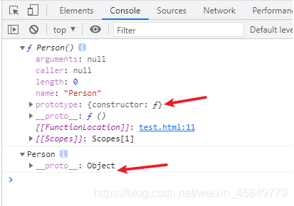
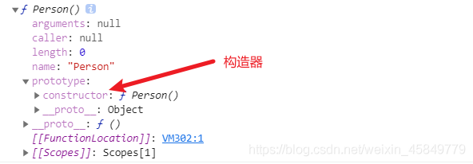
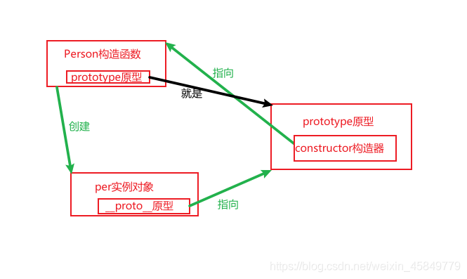
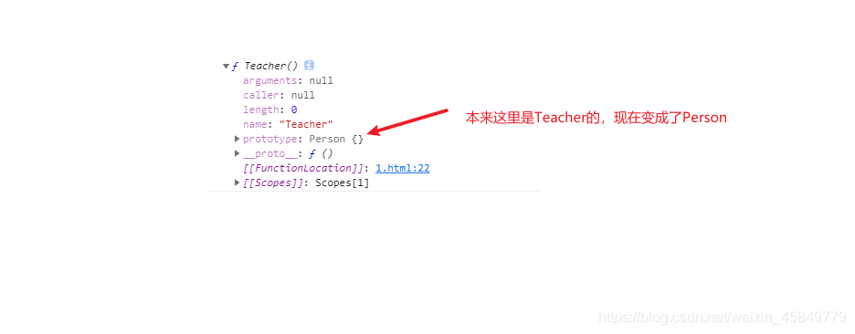
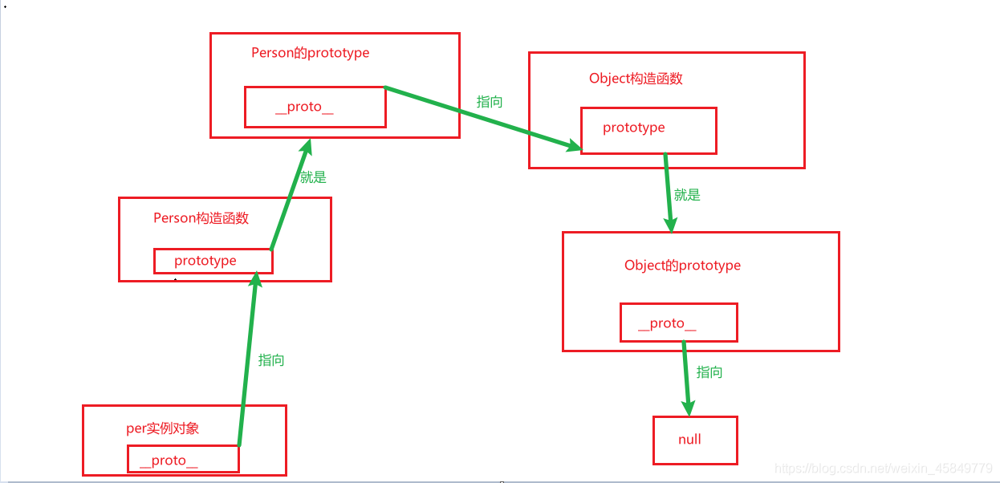

# 1.javascript 原型

## 1.1 什么是原型

注意：理解原型之前首先要知道什么是**构造函数**。在 JavaScript 中，用 new 关键字来调用的函数，称为构造函数。构造函数首字母一般大写（规范）。

```javascript
//这就是一个非常普通的构造函数
function Person() {}
//那下面我就用这个构造函数来实例化一个对象
var per = new Person();

//分别打印构造函数Person和实例对象per的所有属性和属性值
console.dir(Person);
console.dir(per);
```



> 可以看到：构造函数里面有一个 prototype 属性，实力对象里面有一个**proto**属性，这两个属性都叫原型，也叫原型对象。
> 需要注意的是：原型**proto**一般是给浏览器使用的，不是标准的属性，为什么这样说，因为 ie8 里面是没有这个属性的。而原型 prototype 才是程序员会使用到的，是一个标准的属性。

## 1.2 原型的指向

### 1.2.1 实例对象的原型**proto**的指向

```javascript
function Person() {}
var per = new Person();
per.__proto__ === Person.prototype; //true
```

在控制台中输出上面的语句会输出 true，所以这里我们通常就会说实例对象 per 的原型**proto**，指向了构造函数 Person 的原型 prototype。
**所以就得出了一个结论：** 实例对象的**proto**指向了构造函数的原型对象 prototype。

### 1.2.2 构造函数的原型对象 prototype 的构造器的指向

```javascript
function Person() {}
var per = new Person();
Person.prototype.constructor === Person; //true
```



而在原型对象 prototype 中，有一个属性 constructor 构造器,根据上面输出的结果我们通常就会说这个 constructor 构造器指向的就是自己所在的原型对象 prototype 所在的构造函数。
**所以就也得出了一个结论：** 构造函数的原型对象(prototype)中有一个 constructor 构造器,这个构造器指向的就是自己所在的原型对象所在的构造函数。

## 1.3 构造函数与原型对象与实例对象三者的关系

好了，现在大概知道原型**proto**与原型 prototype 之间的关系、构造函数与原型之间的关系之后，我们就可以画出一个关系图（这些关系有什么用，下面 1.4 会说到），这样看的更明了：


## 1.4 原型的作用

原型有两个作用：1.实现数据共享；2.为了实现继承。

### 1.4.1 数据共享

**不好的方法：**

```javascript
function Person(name, eat) {
  //人应该都有一个吃的方法 并且都属于人类

  //那应该怎么写，才能让所有创建出来的实例对象都有这个吃的方法和这个人类的属性呢

  //可以这样操作，在实例化对象的时候，传进去人类的属性和吃的方法
  this.name = name;
  this.eat = eat;
}
function eat() {
  console.log("吃");
}
let per = new Person("人类", eat);
console.log(per.name); //人类
per.eat(); // 吃

//总结：
/*
    上面的方法确实可以实现目的，但是会有两个缺点：
    1.命名的问题，要是我们写代码的过程中命名冲突了，有两个eat的方法，那么后面的就会把前面的给覆盖了,所以很同意造成命名冲突的问题
    2.要是我要创建1000个人的实例对象，就要反复的传1000次这个'人类'和eat的方法，十分烦琐
    */
```

**好的方法：利用原型来实现**

```javascript
function Person() {}
Person.prototype.name = "人类";
Person.prototype.eat = function () {
  console.log("吃");
};
let per1 = new Person();
let per2 = new Person();
console.log(per1.name); //人类
console.log(per2.name); //人类
per1.eat(); // 吃
per2.eat(); // 吃

//总结：
/*
    上面的利用原型就完美的解决了之前的两个问题：
    1.命名冲突的问题，因为它们根本就没有拿全局的变量；
    2.需要反复传入参数的问题，因为写在prototype中的属性和方法都是共享的，每一个实例对象都可以访问到
    */
```

> 理解：
> 这里要思考一下为什么实例对象中可以访问到构造函数原型 prototype 中的属性和方法呢，原因就是因为我们之前说的实例对象的原型**proto**指向了构造函数的原型 prototype;
> 实例对象使用的属性或者方法,先在实例中查找,找到了则直接使用,找不到，则去实例对象的**proto**指向的原型对象 prototype 中找,找到了则使用,找不到则报错。

### 1.4.2 实现继承

```javascript
//这是一个人的构造函数
function Person() {}
Person.prototype.name = "人类";
Person.prototype.eat = function () {
  console.log("吃");
};

//这是一个老师的构造函数
function Teacher() {}

//老师是属于人类的范畴，那么老师也肯定是有 人类和吃 的属性或方法
//那么我们要重新给老师的构造函数的原型添加这两个属性吗？
//那肯定是不需要的，我们可以用继承来实现（而js实现继承的原理就是改变了原型prototype的指向）
Teacher.prototype = new Person(); //这样我们就改变了原型的指向
var teacher = new Person();
console.log(teacher.name); //人类
teacher.eat(); //吃
```

我们将 **Teacher.prototype = new Person()** 之后，如果输出 **console.dir(Teacher)** 构造函数你会发现如下图：

js 实现继承的原理就是改变了原型 prototype 的指向，现在 Teacher 的 prototype 指向了 new Person()后的一个实例对象，所以我们用 Teacher 创建出来的实例对象，也是有 Person 构造函数的属性和方法的，这样就可以说 Teacher 继承了 Person。

# 2.javascript 原型链

**原型链:** 是一种关系,实例对象和原型对象 prototype 之间的关系,关系是通过原型**proto**来联系的。

**下面我们来推导出一整条原型链：**

```javascript
function Person() {}
var per = new Person();
console.dir(per);
console.dir(Person);

//实例对象中有__proto__原型
//构造函数中有prototype原型

//prototype是对象
//所以,prototype这个对象中也有__proto__,那么指向了哪里
//实例对象中的__proto__指向的是构造函数的prototype
//所以,prototype这个对象中__proto__指向的应该是某个构造函数的原型prototype

//打印一下下面的语句：
//console.log(Person.prototype.__proto__);
//console.log(Object.prototype)
console.log(Person.prototype.__proto__ === Object.prototype); //true
//由上面可以推出：Person.prototype.__proto__指向了Object.prototype

//所以：
//per实例对象的__proto__指向Person.prototype
//Person.prototype的__proto__指向Object.prototype
//Object.prototype的__proto__是null

console.log(per.__proto__ == Person.prototype); //true
console.log(per.__proto__.__proto__ == Person.prototype.__proto__); //true
console.log(Person.prototype.__proto__ == Object.prototype); //true
console.log(Object.prototype.__proto__); //null
```

**下面我们把这条原型链画出来：**

**总结：**
**1.原型链：** 是一种关系,实例对象和原型对象 prototype 之间的关系,关系是通过原型**proto**来联系的。
**2.原型链最终指向是：** 原型链最终的指向是 Object 的 prototype 中的**proto**是 null。
