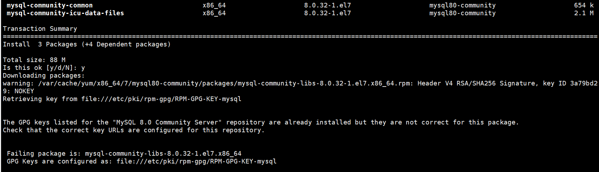
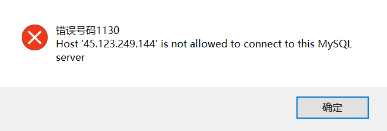

# linux 部署 nodejs 生产环境

## 安装 node

下载地址： https://nodejs.org/en/download

1. 直接在官网中下载，然后通过 ftp 工具丢到服务器再进行解压安装

2. 可以通过命令下载，然后解压安装（下载的目录自行选择，这里下载到/usr/local）

```bash
wget https://nodejs.org/dist/v17.0.0/node-v17.0.0-linux-x64.tar.xz
```

3. 解压下载的压缩包

```bash
tar -xvf node-v17.0.0-linux-x64.tar.xz
```

4. 更改解压出来的文件夹名称（可以选择不更改，为了后面方便输入文件夹名称，我这里将其改成 node）

```bash
mv /usr/local/node-v17.0.0-linux-x64 /usr/local/node
```

5. 配置环境变量

输入命令后按 i 键进行修改，最后修改完后按 esc 键，然后输入:wq 保存退出

```bash
vim /etc/profile
```

在 profile 文件最后一行加上 export PATH=$PATH:/usr/local/node/bin

6. 让新的配置生效

```bash
source /etc/profile
```

7. 配置软链接，查看 node 版本：node -v，查看 npm 版本：npm -v

```bash
ln -s /usr/local/node/bin/node /usr/local/bin/
ln -s /usr/local/node/bin/npm /usr/local/bin/
```

## 安装 git

下载地址：https://github.com/git/git/tags

1. 下载依赖包

```bash
yum install curl-devel expat-devel gettext-devel openssl-devel zlib-devel gcc perl-ExtUtils-MakeMaker
```

2. 下载 git 到服务器，解压后编译安装

```bash
tar zxvf git-2.33.3.tar.gz
cd git-2.33.3
make prefix=/usr/local/git all
make prefix=/usr/local/git install
```

3. 配置环境变量

```bash
vim /etc/profile
```

在 profile 文件最后一行加上 export PATH=$PATH:/usr/local/git/bin

4. 让新的配置生效

```bash
source /etc/profile
```

5. 设置 git 全局用户名和邮箱

```bash
git config --global user.name "xxx"
git config --global user.email "xxx"
```

6. 为 github 账号添加 SSH keys（系统会提示 key 的保存位置（一般是~/.ssh 目录）和指定口令，保持默认，连续三次即可）

```bash
ssh-keygen -t rsa -C "xxx@qq.com"
```

7. 后 vim 打开 id_rsa.pub 文件，粘贴到 github 账号管理的添加 SSH KEY 界面中

```bash
vim ~/.ssh/id_rsa.pub
```

## 安装 mysql

1. 下载 mysql（可以在这里：https://dev.mysql.com/downloads/repo/yum/ 看当前最新版本）

```bash
rpm -ivh http://dev.mysql.com/get/mysql80-community-release-el7-3.noarch.rpm
```

2. 安装 mysql

```bash
yum install -y mysql-server
yum install mysql-community-server
```



ps：如果有上面错误，导入 key 后重新安装，终端显示 Complete 则安装完成

```bash
rpm --import https://repo.mysql.com/RPM-GPG-KEY-mysql-2022
```

3. 设置开机启动 Mysql

```bash
systemctl enable mysqld.service
```

4. 检查是否已经安装了开机自启动

```bash
systemctl list-unit-files | grep mysqld
#如果显示以下内容说明已经完成自动启动安装：mysqld.service enabled
```

5. 设置开启服务

```bash
systemctl start mysqld.service
```

6. 登录修改 mysql 密码

```bash
#查看mysql默认密码
grep 'temporary password' /var/log/mysqld.log
#第一次登录mysql，输入账号和默认密码
mysql -uroot -p
#修改当前密码（MySQL8.0修改密码需要有大小写字母、数字、特殊字符组合）
mysql> ALTER USER 'root'@'localhost' IDENTIFIED BY '你的密码';
#命令立即执行生效
mysql> flush privileges;
```

7. 补充：外网/客户端访问问题，比如 navicat 连接
   
   解决方案，登录 MySQL，修改 user 表登录用户的 host

```bash
#远程设置
mysql> use mysql;
mysql> update user set host='%' where user='root';
#授权用户名的权限，赋予任何主机访问数据的权限
mysql> GRANT ALL PRIVILEGES ON *.* TO 'root'@'%' WITH GRANT OPTION;
mysql> FLUSH PRIVILEGES;
```

8. 然后又出现了下面问题
   
   mysql 登录用户密码设置好后,需要开发安全组端口，并且好像上面的不是 mysql8.0 版本，因为 8.0 版本的加密方式改变了，mysql8 以后的加密规则为 caching_sha2_password，所以我们需要将 mysql 用户登录的加密规则修改为 mysql_native_password(注意，由于之前改了 user，这里@"%")

```bash
mysql> ALTER USER 'root'@'%' IDENTIFIED BY '你刚刚设置的mysql密码' PASSWORD EXPIRE NEVER;
mysql> ALTER USER 'root'@'%' IDENTIFIED WITH mysql_native_password BY '你刚刚设置的mysql密码';
mysql> FLUSH PRIVILEGES;
```

9. 补充：数据库的相关操作

```bash
#启动mysql
systemctl start mysqld.service

#结束
systemctl stop mysqld.service

#重启
systemctl restart mysqld.service

#开机自启
systemctl enable mysqld.service
```

## 安装 nginx

下载地址：http://nginx.org/en/download.html

1. 安装依赖包

```bash
yum install -y gcc-c++ pcre pcre-devel zlib zlib-devel openssl openssl-devel
```

2. 选择 nginx 版本下载（当前下载在/usr/local）

```bash
wget http://nginx.org/download/nginx-1.23.1.tar.gz
```

3. 解压下载的压缩包

```bash
tar -xvf nginx-1.23.1.tar.gz
```

4. 配置 nginx 并安装

```bash
cd nginx-1.23.1
./configure #配置nginx
make
make install
```

5. 配置软链接

```bash
ln -s /usr/local/nginx/sbin/nginx  /usr/local/bin/
```

6. 设置 nginx 开机自启

```bash
cd /etc/systemd/system
vim nginx.service
#设置文件权限
chmod 755 nginx.service
#设置开机自启动
systemctl daemon-reload
systemctl enable nginx
```

将下面内容粘贴进去 nginx.service（此处要注意 nginx 安装的路径，当前是在/usr/local/nginx）

```
[Unit]
Description=nginx service
After=network.target

[Service]
Type=forking
ExecStart=/usr/local/nginx/sbin/nginx
ExecReload=/usr/local/nginx/sbin/nginx -s reload
ExecStop=/usr/local/nginx/sbin/nginx -s quit
PrivateTmp=true

[Install]
WantedBy=multi-user.target
```

7. nginx 补充

```bash
#启动nginx服务
systemctl start nginx
#查看nginx运行状态
systemctl status nginx
#重启nginx服务
systemctl restart nginx
#停止nginx服务
systemctl stop nginx
#设置nginx服务开机自启动
systemctl enable nginx
#取消设置nginx服务开机自启动
systemctl disable nginx
```

## 安装 pm2（管理 node 项目）

1. 全局安装 pm2，使用 pm2 -v 查看是否安装成功

```bash
npm install pm2 -g
```

2. 使用 pm2 管理 node 项目

```bash
cd /usr/local/school_manage/server
pm2 start app.js --name school_manage
```
